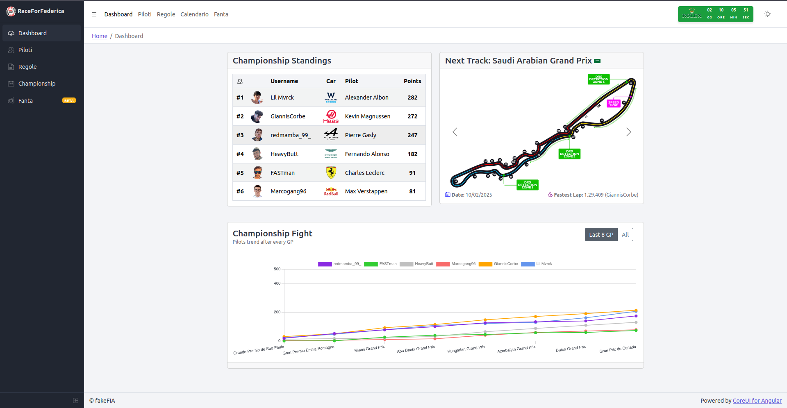
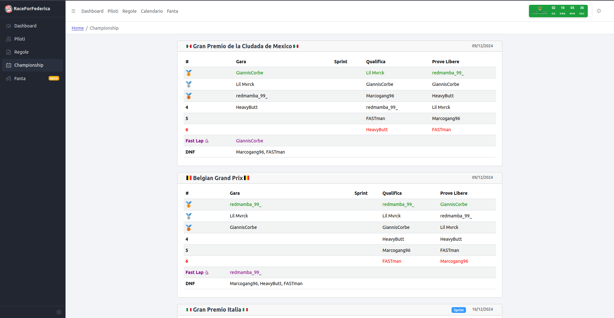
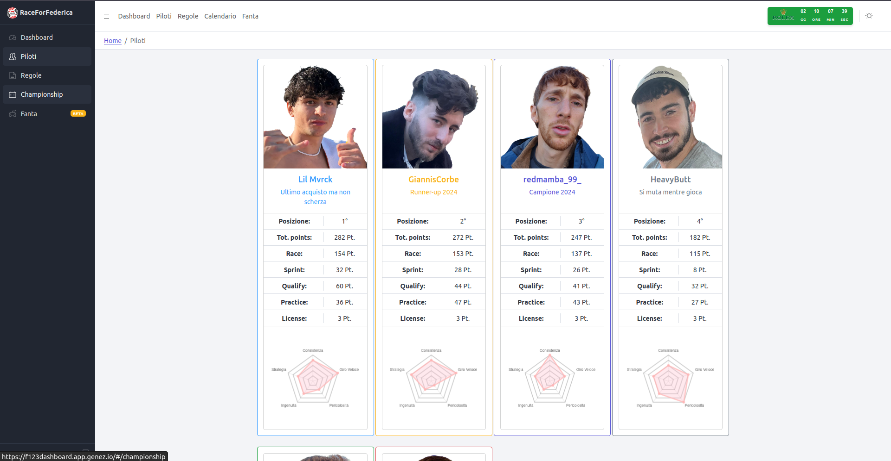
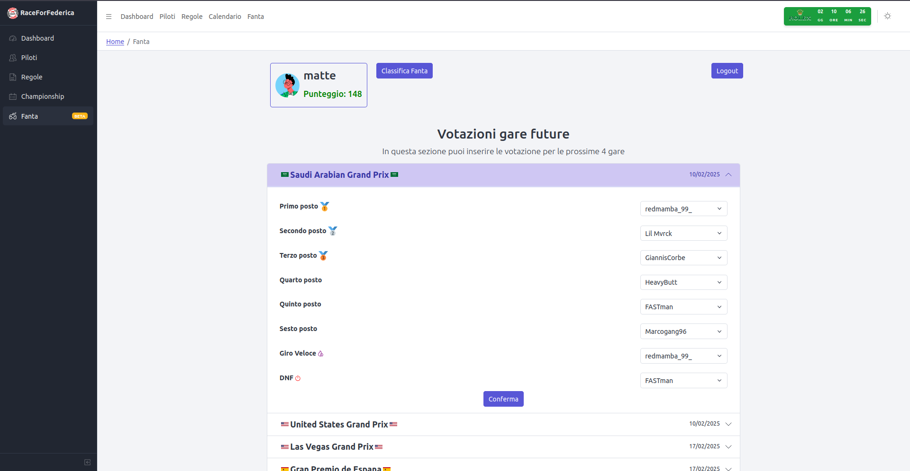
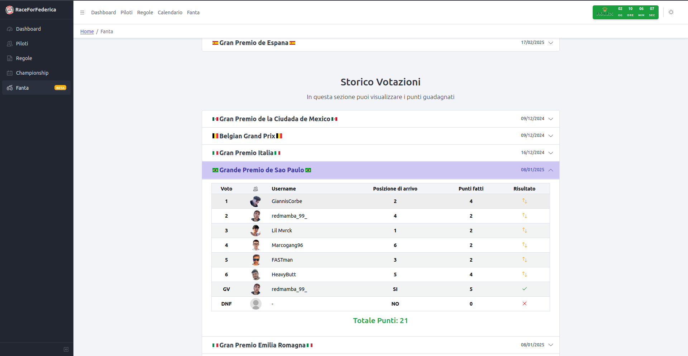

  
  
  

# F1 Dashboard RaceForFederica

Dashboard for the Esport F1 23 championship (friendly, but not so much...)

## Preview 🧐

| **Dashboard**                                              | **Championship**                                             |
| ------------------------------------------------------------ | ------------------------------------------------------------ |
|  |  |
| **Pilots**                                                   | **Fantasy F1**                                               |
|  |  |
| **Fantasy F1 Vote**                                          | **Fantasy F1 Result**                                        |
|  |  |

## Building and Running 🛠️

The website is hosted on [Genezio](https://genezio.com/). The db as well.

Build both the client and server with `npm install`.

Run `genezio local` to run it locally.

Run `genezio deploy` to deploy remotely on genezio infrastracture.

## Notes 📋

- quando cambi le funzioni dentro `server/src/db_interface.ts`, fai un `npm add @genezio-sdk/f123dashboard@1.0.0-prod` dentro la cartella del client. Se no le funzioni aggiunte non le riconosce.
- per azzerare il numero di partenza di un indice sequenziale nel db:
  - `SELECT pg_get_serial_sequence('table_name', 'column_name');` per trovare il nome del campo sequenziale
  - `ALTER SEQUENCE public.fanta_player_new_id_seq RESTART WITH 1` per farlo ripartire da 1
- per lanciare in locale, ricordati di settare la variabile d'ambiente `RACEFORFEDERICA_DB_DATABASE_URL` alla stringa di connessione al db postgre

## Todo 🎯

- offri un caffè agli sviluppatori
- link a pagina instagram e twitch (con plug-in integrati)

## Todo Next Season 🔜

- gestione stagioni da menu a tendina (e in DB)
- voto pole position x fanta
- sicurezza dati utenti fanta
- Moltiplicatore punteggi
- Admin deve poter caricare i risultati delle gare da sito
- Query asicrone su ogni pagina
- pagina albo d'oro
- aggiungere descrizione gara nella pagina dei risultati
- foto nuove piloti

## Credits 🙇

Credits for this small but fun project goes to:

- [Paolo Celada](https://github.com/paocela)
- [Federico Degioanni](https://github.com/FAST-man-33)
- [Andrea Dominici](https://github.com/DomiJAR)
